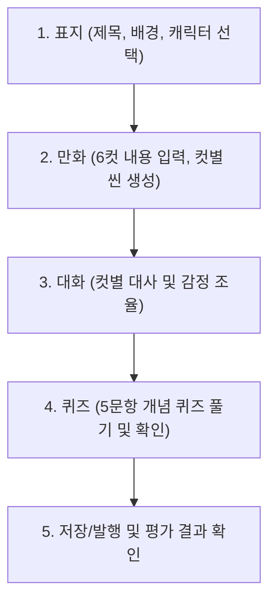

# 툰스쿨 공통 UI 레이아웃 설계 문서 (toonschool-layout-plan)

본 문서는 사용자 역할 및 작업 상황에 따라 다르게 적용되는 툰스쿨의 공통 레이아웃 구조와 디자인 일관성 기준을 정의합니다.

---

## 1. 레이아웃 분류 및 구조

툰스쿨은 어두운 관리 화면과 밝고 몰입감 넘치는 에디터/학생 화면이 섞여 화면 정체성이 꼬이는 것을 방지하기 위해 다음과 같이 3개의 공통 레이아웃으로 완전히 격리합니다.

### 1-1. 관리자 계열 레이아웃 (Admin/Teacher Layout)
*   **적용 대상**: `super_admin`, `org_admin`, `teacher`
*   **특징**: 대량의 정보(카드, 테이블, 그래프, 통계 목록)를 효율적으로 탐색하기 위해 화면 공간을 최대로 활용하는 차분하고 전문적인 레이아웃입니다. (어두운 테마 기반)
*   **구조**: **좌측 고정 메뉴 사이드바 + 상단 글로벌 헤더 + 본문 영역**
```text
┌─────────────────┬──────────────────────────────────────────────────────┐
│  좌측 사이드바   │  상단 헤더 (현재 계정 정보, 소속 기관, 알림 버튼)   │
│                 ├──────────────────────────────────────────────────────┤
│  - 대시보드     │  본문 영역                                           │
│  - 사용자 관리  │                                                      │
│  - 클래스 관리  │  - 상태 통계 카드                                    │
│  - 설정 등      │  - 사용자 목록 테이블                                │
│                 │  - 현황 분석 차트                                    │
└─────────────────┴──────────────────────────────────────────────────────┘
```

---

### 1-2. 학생 에디터 레이아웃 (Student Editor Layout)
*   **적용 대상**: `student` (학습툰 생성 및 편집 상태)
*   **특징**:
    > [!IMPORTANT]
    > **기존 개발자용 어두운 사이드바(aside)를 절대 사용하지 않습니다.**
    > 만화를 그리는 창작 활동에 온전히 집중할 수 있도록 시각적 방해 요소를 모두 제거한 **밝은(Light) 테마 기반의 단독 전체 화면**을 제공합니다.
*   **구조**: **상단 화이트 헤더 + 좌측 작업 입력 패널 + 우측/중앙 실시간 A4 미리보기 + 하단 상태 표시줄**
```text
┌────────────────────────────────────────────────────────────────────────┐
│  상단 헤더 (뒤로가기, 임시저장 상태, [PDF 다운로드] [공유하기] [저장하기])│
├──────────────────────────────┬─────────────────────────────────────────┤
│  좌측 작업 패널              │  중앙/우측 실시간 미리보기              │
│                              │                                         │
│  - 탭: [표지][만화][대화][퀴즈]│  - A4 비율 표지 디자인 미리보기         │
│  - 주제 및 개념 입력 필드    │  - 6컷 만화 씬 및 캐릭터 실시간 렌더링   │
│  - 대사/말풍선 입력 폼       │                                         │
├──────────────────────────────┴─────────────────────────────────────────┤
│  하단 상태 바 (진행 상태 게이지, 단축키 안내, 저장 로그 정보)             │
└────────────────────────────────────────────────────────────────────────┘
```

---

### 1-3. 공유 보기 레이아웃 (Share View Layout)
*   **적용 대상**: `guest` (외부 공유 방문자)
*   **특징**: 로그인 유도 메뉴나 불필요한 내비게이션을 배제하고 오로지 완성된 학습툰을 쾌적하게 감상하고 보관하는 데에 최적화된 심플한 레이아웃입니다.
*   **구조**: **상단 단순 뷰어 헤더 + 중앙 만화 감상 영역 (A4 또는 모바일 최적화 세로 스크롤)**
*   **제한 사항**: 수정, 삭제, AI 평가 재요청 등 데이터를 변경할 수 있는 모든 액션 버튼은 노출하지 않고 읽기 권한만 제공합니다.

---

## 2. 구성 요소 세부 스펙

### 2-1. 상단 헤더 구성

*   **관리자 헤더**:
    *   좌측: 햄버거 메뉴 버튼(모바일용) 및 현재 위치 브레드크럼(Breadcrumb)
    *   우측: 소속 기관명 배지, 종 알림 아이콘, 프로필 아바타(로그아웃 단추 포함)
*   **학생 에디터 헤더**:
    *   좌측: `[나가기]` 버튼 (클릭 시 "작성 중인 내용이 저장되지 않을 수 있습니다" 확인 모달 오픈 후 대시보드로 이동)
    *   중앙: 학습툰 제목 입력 영역 및 실시간 자동 저장 상태("구름에 안전하게 저장됨")
    *   우측: `[PDF 다운로드]`, `[공유 링크 복사]`, `[작품 발행 및 제출]` 등 핵심 액션 버튼 배치

### 2-2. 좌측 메뉴 사용 기준

*   **사이드바 메뉴가 허용되는 경우**:
    *   관리자/교사 전용 대시보드 화면(`/super-admin`, `/admin`, `/teacher` 하위 라우트 전체)
    *   학생 홈 화면(`/student`)이나 성장 그래프 확인 화면(`/student/progress`) 등 관리 대시보드 성격의 화면 (단, 이 경우에도 어둡고 투박한 관리자용 디자인 대신 학생 친화적인 둥글고 밝은 파스텔톤 사이드바로 분리 적용 권장)
*   **사이드바 메뉴가 금지되는 경우**:
    *   학생 에디터 편집 화면(`/student/comics/:id/edit`)
    *   공유 보기 화면(`/share/:shareSlug`)

### 2-3. 에디터 탭 구조 및 입력/출력 흐름

학생 에디터는 아래의 작업 순서(프로세스)를 자연스럽게 탭 인터페이스로 녹여냅니다.



*   **입력 패널**: 사용자의 텍스트 입력, 학년/단원 설정, 캐릭터 이미지 조합 선택에 최적화된 폼 배치.
*   **출력 미리보기**: 실제 인쇄나 공유 시 보게 될 완성본과 100% 동일한 A4 레이아웃을 실시간 렌더링(WYSIWYG)하여 직관성 극대화.
